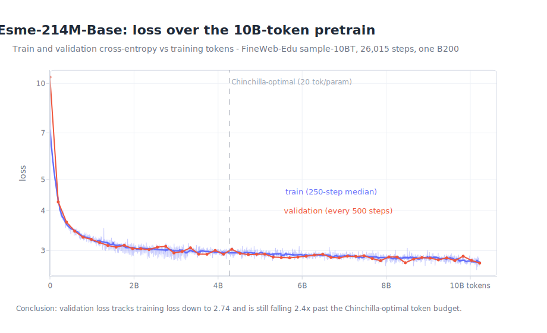
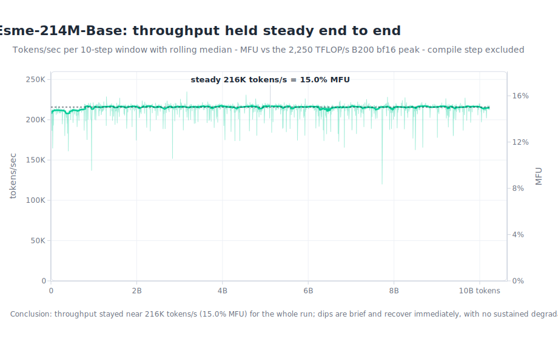

# esme-pretrain

 

`esme-pretrain` trains `Esme-214M-Base`, a 214M-parameter dense decoder-only
language model, from scratch on FineWeb-Edu `sample-10BT` and exports it as an
`llm-infer` bundle.

It covers the base-model path: data preparation, tokenizer training, model code,
training checks, checkpoint evaluation, reporting, and export.

The current base checkpoint comes from one accepted run, `pretrain_214m_b200`.
Its [`run card`](docs/run-cards/pretrain-214m-b200.md), locked config, fixed
checkpoint eval, bits-per-byte report, acceptance report, export bundle, and
telemetry plots are the evidence trail.

At 214M parameters, Esme is small enough to debug and cheap enough to run end to
end, while still exercising the real base-model lifecycle: train, evaluate,
export, post-train, and serve.

For the model and training design, read
[`docs/architecture.md`](docs/architecture.md), then run the local checks in
[Quickstart](#quickstart).

## Current State

`Esme-214M-Base` is the current base checkpoint: 213,960,192 parameters trained
on a nominal `10B`-token budget: `10,229,514,240` tokens over `26,015`
optimizer steps.

The base model is ready for downstream work. The next step is post-training in
`esme-posttrain`, not another pretraining launch.

## How Good Is It?

`Esme-214M-Base` was scored against two pinned public base models with the
repo's own harness: [Cerebras-GPT-256M](https://huggingface.co/cerebras/Cerebras-GPT-256M)
(a similar training budget: 5.1B tokens vs Esme's 10.2B) and
[Pythia-160M](https://huggingface.co/EleutherAI/pythia-160m) (~29x Esme's
training tokens). All models ran deterministic fp32 forward passes on identical
inputs. Before any Esme score was recorded, the harness had to reproduce
Cerebras's published 0-shot table; it matched every task within ±0.002.

0-shot accuracy via a pinned `lm-eval` (best per task in bold):

| Task | Esme-214M-Base | Cerebras-GPT-256M | Pythia-160M |
| --- | --- | --- | --- |
| arc_challenge | **0.244** | 0.169 | 0.195 |
| arc_easy | **0.581** | 0.410 | 0.436 |
| hellaswag | **0.325** | 0.274 | 0.284 |
| lambada_openai | 0.307 | 0.294 | **0.354** |
| openbookqa | **0.206** | 0.158 | 0.150 |
| piqa | **0.659** | 0.614 | 0.623 |
| winogrande | **0.531** | 0.513 | 0.513 |
| **average** | **0.408** | 0.347 | 0.365 |

Bits per byte on identical text (enforced by hash), each model using its own
tokenizer:

| Text slice | Esme-214M-Base | Cerebras-GPT-256M | Pythia-160M |
| --- | --- | --- | --- |
| FineWeb-Edu validation | **0.901** | 1.065 | 1.017 |
| Pile test | 1.283 | 0.955 | **0.902** |

Read both tables together and the honest claim is: for its budget, Esme is a
strong educational-domain base model, not a general-web one. It beats both
baselines on 6 of 7 downstream tasks — including Pythia, which trained on ~22x
the compute — but it also has the worst bits per byte on Pile text, and the
task suite sits close to FineWeb-Edu's home distribution. None of these are
matched-compute comparisons: Esme has 2x Cerebras's tokens plus a more modern
recipe, and Pythia has ~22x Esme's compute.

Reproduce with the `baseline-gate` / `baseline-eval` / `baseline-compare`
commands in [Common Commands](#common-commands); no Esme downstream score can
be produced until the gate passes.

## Training Telemetry

Telemetry from the `pretrain_214m_b200` run, plotted from the run's
`metrics.jsonl` and `throughput.csv`:





## What Is Here

- Data tools for local text files and FineWeb-Edu streaming splits.
- A byte-level BPE tokenizer contract with digit splitting.
- Plain `torch` model and training code, with no `transformers`, `Trainer`, or
  `accelerate` dependency.
- Production model code in
  [`DenseBackbone`](src/esme_pretrain/modeling/backbone.py) and
  `BackboneConfig`: grouped-query attention, RoPE, RMSNorm, SwiGLU, QK-norm,
  tied embeddings, and z-loss.
- Training code with checkpoint/resume checks, fixed validation batches, local
  metrics, optional W&B logging, mixed precision, and token-accurate resume.
- Training entrypoints for the current 214M B200 shape, launched with an
  explicit `--approved` flag.
- Post-training evaluation, bits-per-byte reporting, and `llm-infer` export.

Active code lives in [`src/esme_pretrain/`](src/esme_pretrain/).

## Quickstart

Install the dev environment:

```bash
uv sync --extra dev
```

Check the repo:

```bash
uv run ruff check .
uv run ruff format --check .
uv run pytest
uv run esme-pretrain status --json
uv run esme-pretrain doctor
```

`doctor` expects no `origin` remote or one containing `adamthuvesen/esme-pretrain`
by default. For a fork or mirror, pass the expected owner/repo substring:

```bash
uv run esme-pretrain doctor --expected-origin <owner/repo>
```

Check the pretraining launch config without touching data or GPUs:

```bash
uv run esme-pretrain pretrain-214m-b200 --config configs/pretrain_214m_b200.json --dry-run --json
```

That command checks the pinned config, dataset revision, split rule, GPU profile,
token budget, artifact manifest, and Modal command. It does not download data or
start training.

## Common Commands

```bash
# Prepare a local text dataset into packed tokens
uv run esme-pretrain prepare-data \
  --input <text-file> --output-dir data/processed/<name> \
  --context-length 1024 --token-budget <tokens> --json

# Evaluate a checkpoint on the fixed validation batches
uv run esme-pretrain eval-checkpoints \
  --config configs/pretrain_214m_b200.json --tokenizer <run-dir>/tokenizer.json \
  --checkpoint <run-dir>/checkpoint.pt --eval-token-budget 10000000 \
  --output <run-dir>/base-eval.json --json

# Turn an eval into an acceptance report
uv run esme-pretrain base-acceptance-report \
  --run-dir <run-dir> --eval <run-dir>/base-eval.json \
  --output <run-dir>/base-acceptance-report.md --json

# Export the selected checkpoint for llm-infer
uv run esme-pretrain export \
  --checkpoint <selected-checkpoint.pt> --tokenizer <run-dir>/tokenizer.json \
  --format llm-infer --output exports/pretrain-214m-b200 --json

# Compare the exported bundle against public baselines (needs the baselines extra)
uv run --extra baselines esme-pretrain baseline-gate \
  --config configs/baseline_eval.json --output out/gate.json --json
uv run --extra baselines esme-pretrain baseline-eval \
  --config configs/baseline_eval.json --model esme --gate out/gate.json \
  --output out/esme.json --json
uv run esme-pretrain baseline-compare \
  --result out/esme.json --result out/cerebras.json --result out/pythia.json \
  --output out/comparison.md
```

The baseline comparison scores `Esme-214M-Base` against pinned public base
models (Cerebras-GPT-256M, Pythia-160M) on bits-per-byte over shared text and
0-shot lm-eval tasks. Esme results only exist after `baseline-gate` reproduces
Cerebras's published numbers, which proves the harness before it grades Esme.

## Full Pretraining

A full run streams FineWeb-Edu and trains on rented GPUs via Modal. The
entrypoint only launches with an explicit `--approved` flag. Use a detached Modal
launch so a local disconnect does not stop training.

B200 was picked because measurements on H100, H200, and B200 showed it had the
lowest cost per token for this run.

## Documentation

- Current state: [`docs/status.md`](docs/status.md)
- Model and training design: [`docs/architecture.md`](docs/architecture.md)

## Related Repositories

These repositories are separate codebases connected by model artifacts and
measurement questions:

- [`esme-pretrain`](https://github.com/adamthuvesen/esme-pretrain): trains
  `Esme-214M-Base` from scratch.
- [`esme-posttrain`](https://github.com/adamthuvesen/esme-posttrain): adapts
  the base checkpoint with SFT, DPO, and verifier-backed RLVR.
- [`llm-infer`](https://github.com/adamthuvesen/llm-infer): loads, serves, and
  benchmarks exported Esme checkpoints.
- [`llm-rlvr`](https://github.com/adamthuvesen/llm-rlvr): provides a reusable
  RLVR harness with text-to-SQL as the reference task.
- [`grpo-decomp`](https://github.com/adamthuvesen/grpo-decomp): measures where
  GRPO gains come from, separating reliability from new capability.

## References

- Lozhkov et al., [_FineWeb-Edu: the Finest Collection of Educational Content_](https://huggingface.co/datasets/HuggingFaceFW/fineweb-edu), 2024.
- Qwen Team, [_Qwen3 Technical Report_](https://arxiv.org/abs/2505.09388), 2025.
- Liu et al., [_MobileLLM: Optimizing Sub-billion Parameter Language Models for On-Device Use Cases_](https://arxiv.org/abs/2402.14905), 2024.
- Allal et al., [_SmolLM2: When Smol Goes Big_](https://arxiv.org/abs/2502.02737), 2025.
