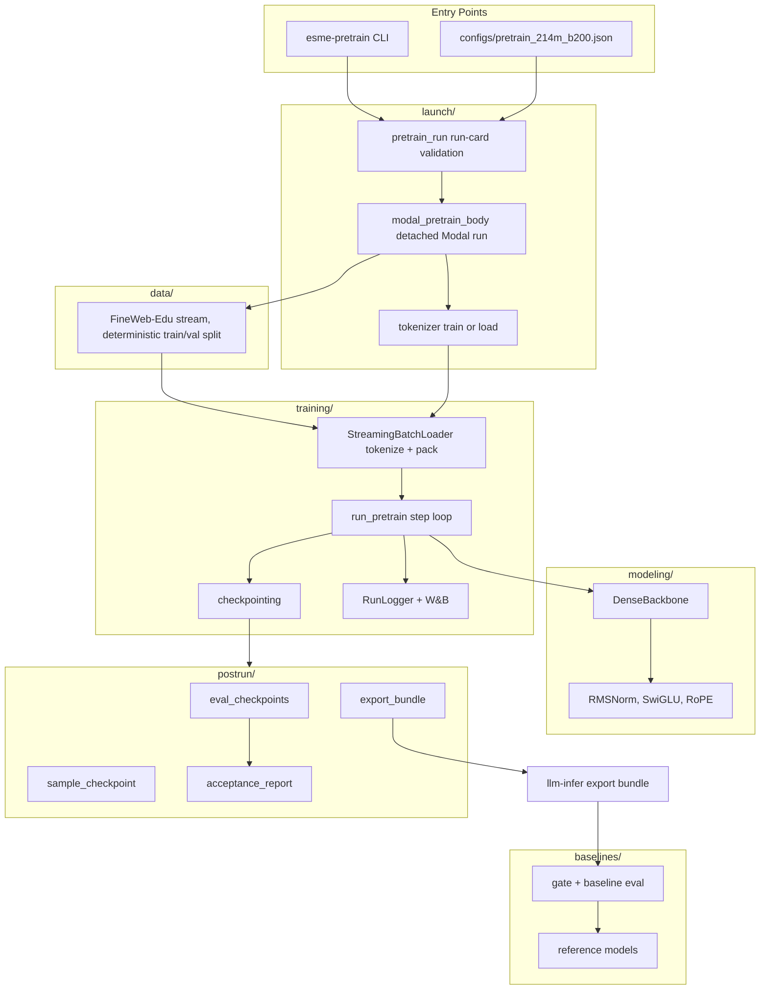

# Architecture

`Esme-214M-Base` is a dense decoder-only transformer defined in
[`src/esme_pretrain/modeling/`](../src/esme_pretrain/modeling/). It is not a fork
of a released model. The design uses current small-model defaults where they
make the training run simpler, stabler, and easier to serve.

## Pipeline Map



The `esme-pretrain` CLI also drives every `postrun/` and `baselines/` command;
those edges are left out of the map to keep the pipeline readable.

Dependency direction stays simple:

```text
cli -> launch + postrun + baselines -> data + training -> modeling
```

The one production model implementation is
[`DenseBackbone`](../src/esme_pretrain/modeling/backbone.py); training, eval,
sampling, and export all build it from the same `BackboneConfig`.

## Run Flow

1. A run card is validated into `PretrainLaunchConfig`
   ([`pretrain_run.py`](../src/esme_pretrain/pretrain_run.py)); `--dry-run`
   prints the run shape and cost estimate without spending.
2. An approved launch spawns a detached Modal function.
   [`modal_pretrain_body`](../src/esme_pretrain/launch/modal_pretrain_body.py)
   loads or trains the digit-split tokenizer, then streams FineWeb-Edu
   documents through the deterministic train/validation split.
3. `StreamingBatchLoader` tokenizes and packs documents into fixed
   context-length token windows feeding `run_pretrain`, which owns the step
   loop, fixed-batch eval, checkpoints, and W&B metrics. All artifacts land on
   the run's Modal volume.
4. Post-run commands reload checkpoints for deterministic eval (the same
   validation token batches for every checkpoint), decoded samples, the
   acceptance report, and bundle export.
5. `baseline-gate` and `baseline-eval` compare the exported bundle against
   reference models on shared validation slices. The bundle is the only
   contract `llm-infer` consumes ([bundle-format.md](bundle-format.md)).

## Model At A Glance

- 213,960,192 parameters.
- 30 layers, `d_model=768`, context length `1024`, vocab `32768`.
- Grouped-query attention with 12 query heads and 4 KV heads.
- `head_dim=64`, SwiGLU MLP with `d_ff=2048`, tied input/output embeddings.
- RoPE positions, RMSNorm, QK-norm, no biases, pre-norm residual blocks.
- Final-logit z-loss during training.
- Digit-split byte-level BPE tokenizer.

The checked-in [`pretrain_214m_b200`](../configs/pretrain_214m_b200.json)
configuration records the current 10B-token run shape.

## Design Choices

| Technique                            | Role in this model                                                           |
| ------------------------------------ | ---------------------------------------------------------------------------- |
| Decoder-only, pre-norm residuals     | Standard autoregressive LM stack; pre-norm keeps deep training stable        |
| RMSNorm                              | Bias-free normalization on the residual stream and Q/K                       |
| RoPE                                 | Relative position without a learned position table                           |
| SwiGLU MLP                           | Gated feed-forward block with strong small-model performance                 |
| GQA                                  | Smaller KV cache and faster attention with little quality cost at this scale |
| QK-norm                              | Bounds attention logits for training stability                               |
| Tied embeddings                      | Saves parameters at small scale                                              |
| Final-logit z-loss                   | Keeps the softmax denominator bounded                                        |
| Residual-projection init scaling     | Keeps residual-stream variance stable at initialization                      |
| FlashAttention-compatible dimensions | Uses the fast attention kernel path                                          |
| Digit-split tokenizer                | Tokenizes numbers as single-digit sequences                                  |

## Geometry

At this parameter budget, a deeper-and-narrower dense model is a good default.
The current shape uses 30 layers at `d_model=768`, which keeps the deep/thin
recipe while leaving enough feed-forward capacity for posttraining and serving.

Qwen3 is the closest current reference for the modern dense transformer stack.
MobileLLM is the main reference for the deep/thin thesis at sub-billion scale.
SmolLM2 is a useful nearby small-model comparison point. The public reference
list lives at the bottom of the root [`README.md`](../README.md).

The code, tokenizer, weights, and training artifacts are all local to this repo.

Decoded samples are generated after training from a saved checkpoint and its
tokenizer. Training RNG state, throughput measurements, and resume behavior are
left unchanged by sampling.

## Deliberately Not Used

| Technique                               | Why it is out of scope for this base model                                        |
| --------------------------------------- | --------------------------------------------------------------------------------- |
| Logit soft-capping                      | QK-norm plus z-loss cover the stability goal without adding another logit clamp.  |
| MLA                                     | Useful for large-scale KV-cache efficiency; GQA is enough at 214M.                |
| MoE                                     | A scale-out capacity technique; this model stays dense.                           |
| MTP                                     | A training/decoding-speed feature left out of the current base.                   |
| Sliding-window / local-global attention | Long-context efficiency is unnecessary at context length `1024`.                  |
| Muon / μP / sandwich-norm               | Avoided to keep the current base low-risk and easy to reproduce.                  |
