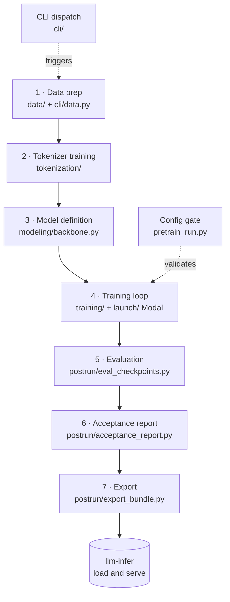
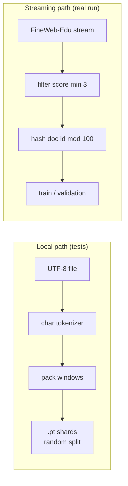
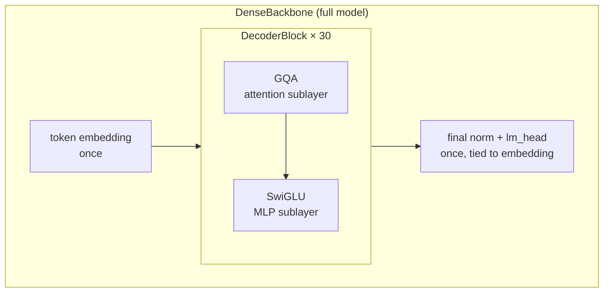
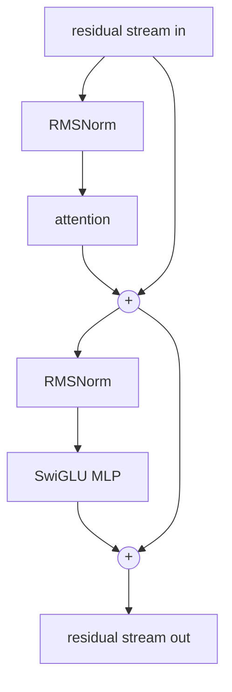
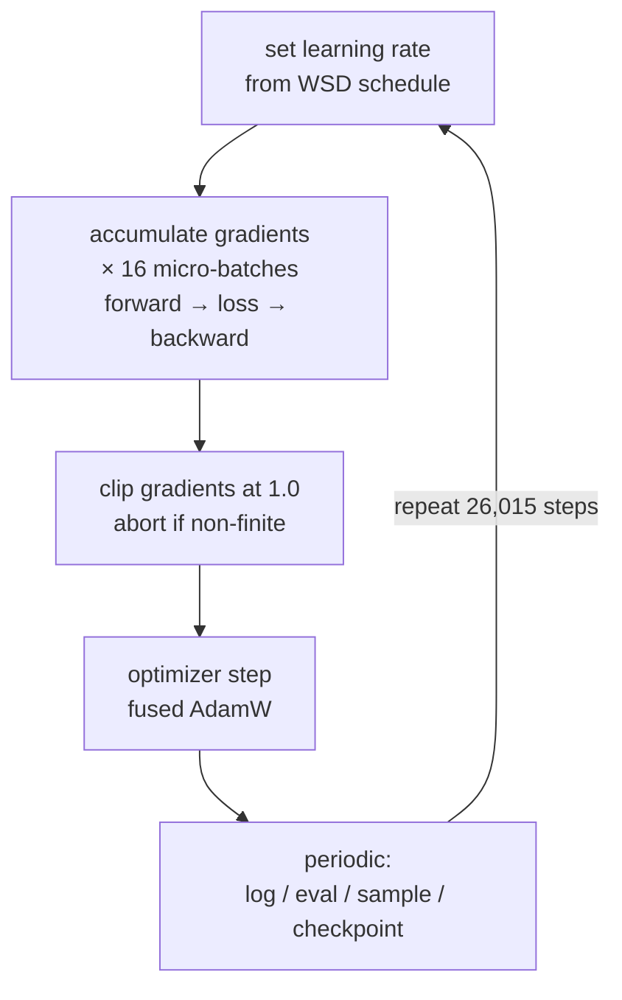
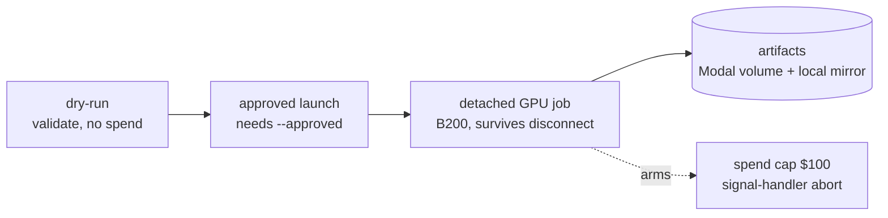
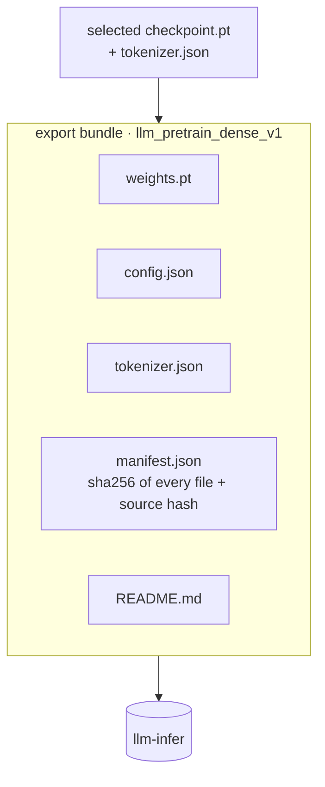

# Pipeline Walkthrough

A get-up-to-speed guide to how `esme-pretrain` works, end to end. Read this to
rebuild the mental model quickly: the phases, the packages that own them, and the
two ideas that run through everything.

For the authoritative design and run details, see
[`architecture.md`](../architecture.md), [`status.md`](../status.md), and the
[214M run card](../run-cards/pretrain-214m-b200.md). This doc is the map that ties
the code together.

## One Line

Raw text in, a servable base model out — deliberately small (214M) so the whole
LLM lifecycle is visible, fast, and cheap to run.

`Esme-214M-Base`: 213,960,192-parameter dense decoder-only transformer, trained
from scratch on FineWeb-Edu `sample-10BT` for 26,015 steps (~10B tokens).

## Repo At A Glance

Every package under [`src/esme_pretrain/`](../../src/esme_pretrain/) owns one job
in the pipeline.

| Package            | Job                                                      | Key file                          |
| ------------------ | ------------------------------------------------------- | --------------------------------- |
| `cli/`             | Front door — parse `esme-pretrain <cmd>` and dispatch   | `cli/__init__.py`, `cli/parser.py`|
| `data/`            | Stream corpus, deterministic split, pack tokens         | `data/pipeline.py`, `data/document_split.py` |
| `tokenization/`    | Train and apply the byte-level BPE tokenizer            | `tokenization/tokenizer.py`, `lab.py` |
| `modeling/`        | The model (`DenseBackbone`) + checkpoint save/load      | `modeling/backbone.py`, `modeling/layers.py` |
| `training/`        | The training loop, streaming loader, eval, metrics      | `training/pretrain.py`, `training/data_stream.py` |
| `launch/`          | Wrap the run for Modal GPUs + safety validators         | `launch/modal_pretrain_body.py`, `launch/pretrain.py` |
| `postrun/`         | Eval a checkpoint, write the report, export to `llm-infer` | `postrun/eval_checkpoints.py`, `postrun/export_bundle.py` |
| `pretrain_run.py`  | The config contract — validates everything before spend | `pretrain_run.py`                 |

Two pieces are the glue that connects the rest:

- `cli/` is how you trigger any phase — every README command is a subparser here.
- `pretrain_run.py` is the gatekeeper — a validator that refuses to launch unless
  the config exactly matches the locked run shape (dataset revision, model params,
  cost cap, abort rules). This is why a dry-run can never spend money.

## The Two Spines

Two ideas thread through every phase. Spot them and the design makes sense.

- **Determinism.** Hash-based train/validation split, fixed and hashed eval
  batches, resumable token streams counted in tokens, tie-break policies. Any
  checkpoint is comparable to any other; any run is reproducible or resumable.
- **Spend safety.** The config contract, the dry-run that cannot download data or
  start Modal, the `--approved` flag, the cost cap, and fail-loud NaN guards. You
  cannot burn money or produce silent garbage by accident.

A recurring tactic behind both: make the bad state *unrepresentable* instead of
relying on discipline. A validation document cannot leak into training because the
split is a pure hash of its ID; a wrong checkpoint cannot ship because the export
records a source hash.

## Pipeline Overview

## Phase 1 — Data

Turns text into packed `(inputs, targets)` pairs shifted by one token. That
one-token shift **is** next-token prediction: `target[i]` is the token that should
follow `input[i]`, so one forward pass over a 1024-token row yields 1024 training
targets at once.

There are two data paths that barely share code:

- **Local path** ([`data/pipeline.py`](../../src/esme_pretrain/data/pipeline.py),
  via `prepare-data`) — reads a UTF-8 file, uses a character tokenizer, packs
  `.pt` shards, random-shuffle split. For local experiments and tests.
- **Streaming path** ([`data/document_split.py`](../../src/esme_pretrain/data/document_split.py)
  + `data/corpus_stream.py`) — streams FineWeb-Edu from HuggingFace, filters by
  `int_score >= 3`, and splits **by hashing the document ID** (`mod 100`, bucket 0
  is validation). This is what the real 10B run uses; it never lands a file.

Why hash instead of shuffle: a shuffle needs every row in memory, impossible for a
billion-token stream. Hashing decides train-vs-validation per document with no
state, so the same document always lands in the same split — across the trainer,
the tokenizer trainer, and post-run eval. No contamination, and it survives
resume.

Key files: `data/pipeline.py`, `data/document_split.py`, `data/dataset.py`
(`pack_token_ids`), `data/corpus_stream.py`.

## Phase 2 — Tokenizer

A tokenizer is the two-way map between text and integer token IDs; the vocabulary
is its fixed list of known tokens (32768 here). The central tradeoff is vocab size
versus sequence length, and **BPE** is the middle ground.

BPE learns by greedily merging the most frequent adjacent pair, repeatedly, until
it hits the vocab-size cap. A trained tokenizer is the base alphabet plus an
ordered list of merge rules; `encode` replays those merges in order. The
from-scratch `PairMergeTokenizer`
([`tokenization/tokenizer.py`](../../src/esme_pretrain/tokenization/tokenizer.py))
shows the algorithm; production uses HuggingFace byte-level BPE.

Two locked choices on top of plain BPE:

- **Byte-level** — start from the 256 bytes, so there is no unknown character ever
  (any text is ultimately bytes).
- **Digit-split** — numbers tokenize one digit at a time, so the model stays
  compositional on arithmetic and unseen numbers. This trades worse compression
  for better capability, on purpose.

Guardrails the config requires: round-trip checks (`decode(encode(x)) == x`) and a
coverage report, so the tokenizer can never silently mangle data.

`tokenization/lab.py` is a comparison harness — it trains a small `DenseBackbone`
on each candidate tokenizer and reports loss, so the choice is measured, not
asserted.

Key files: `tokenization/tokenizer.py`, `tokenization/lab.py`. Contract enforced in
`pretrain_run.py::_validate_tokenizer`.

## Phase 3 — Model

`DenseBackbone`
([`modeling/backbone.py`](../../src/esme_pretrain/modeling/backbone.py)) maps token
IDs to logits: for every position, a score for every one of the 32768 vocab
entries. The structure is three levels deep.

The mental model that makes transformers click is the **residual stream**: a
running vector per position that the embedding writes, and that each block *adds*
to — never replaces. That is why 30 blocks train stably: gradients flow straight
down the additions.

Each `DecoderBlock` runs two sublayers, each with its own pre-norm and a residual
add: `norm -> attention -> add`, then `norm -> MLP -> add`.

- **Attention** lets positions share information: from each token's vector, produce
  a Query, Key, and Value; score each token's Query against every Key; softmax to
  weights; output the weighted sum of Values. **Causal masking** blocks the future,
  which is what makes it a next-token predictor.
- **GQA** (grouped-query attention) keeps all 12 query heads but shares only 4
  key/value heads (3 queries per KV head). It shrinks the inference KV cache ~3x
  with little quality loss. Plain MHA (12 Q + 12 KV) exists only for throughput
  probes and the tokenizer lab, behind the same interface.
- **MLP** is `SwiGLU` — processes each position independently.

Supporting primitives (in `modeling/layers.py`), each small and each a stability
or efficiency choice: RMSNorm (bias-free normalization), RoPE (position by rotating
Q/K, no learned table), QK-norm (bounds attention logits), tied embeddings (input
matrix reused as the output head), z-loss (bounds the softmax denominator),
residual-init scaling (keeps stream variance stable across 30 layers).

The loss (`language_model_loss`) is cross-entropy on the shifted targets plus a
small z-loss term.

Key files: `modeling/backbone.py`, `modeling/layers.py`. Config presets in
`BACKBONE_CONFIGS` (production, GQA) vs. `PROBE_CONFIGS` (benchmarking, MHA).

## Phase 4 — Training

Training repeats one loop for 26,015 optimizer steps: forward, loss, backward,
clip, step. The run is step-based, not epoch-based, because the loader streams
endlessly.

The non-obvious mechanics:

- **Gradient accumulation** — `backward()` *sums* gradients, so 16 micro-batches of
  24 sequences build a ~393K-token effective batch that fits in memory. Each loss
  is divided by 16 so the accumulated gradient is a mean, not a sum (otherwise the
  effective learning rate is 16x too high).
- **Mixed precision** — the model runs in bf16 for speed and memory, but the
  32k-wide softmax in the loss stays in fp32 for stability. fp16 is rejected (would
  need loss scaling this loop does not wire).
- **WSD schedule** — warmup to peak LR, hold stable, then decay to 10% over the
  final fraction of steps.
- **Speed** — `torch.compile` fuses GPU kernels and fused AdamW does the update in
  one kernel. The first compiled step is excluded from throughput stats because it
  pays a one-time compilation cost.
- **Fail loud** — non-finite loss or gradient norm raises immediately, rather than
  wasting paid compute on garbage.

The streaming loader (`training/data_stream.py`) keeps the GPU fed with a
background producer thread building pinned CPU batches for non-blocking copies.

Checkpoints store weights, optimizer state, RNG state, and `data_offset_tokens`.
On resume, the loader fast-forwards the stream past tokens already seen, so it
continues toward the corpus tail instead of silently re-reading the head.

The loop is device-agnostic; Modal supplies the GPU, gated for safety:

A local, network-free dress rehearsal exercises the whole loop — including a
train → checkpoint → resume cycle — before any spend.

Key files: `training/pretrain.py` (`run_pretrain`), `training/data_stream.py`,
`training/eval_batch.py`, `launch/pretrain.py`, `launch/modal_pretrain_body.py`.

## Phase 5 — Post-run

Three steps close the pipeline: evaluate, report, export.

**Evaluation** (`postrun/eval_checkpoints.py`) builds a fixed set of validation
batches from the hash split and hashes them (`token_batch_sha256`), so every
checkpoint is scored on identical data. Three metrics per checkpoint:

- **CE loss** — cross-entropy on validation. Tokenizer-dependent.
- **Perplexity** = `exp(CE)` — roughly how many tokens the model is choosing among.
- **Bits-per-byte** — CE re-normalized to bytes of original text and converted from
  nats to bits (`/ ln 2`). Tokenizer-independent, so it is the fair yardstick for
  comparing across models.

`select_checkpoint` recommends the final checkpoint unless another beats it by more
than 0.02 CE — prefer the fully-trained model unless an earlier one is meaningfully
better.

**Acceptance report** (`postrun/acceptance_report.py`) is the audit artifact. It
fails if any required artifact is missing, then records the loss trajectory, cost,
throughput, tokenizer round-trip evidence, the eval table, and a sha256 inventory
of every file in the run.

**Export** (`postrun/export_bundle.py`) packages the selected checkpoint into the
`llm_pretrain_dense_v1` bundle for `llm-infer`.

Two things make it correctness-first: it validates the tokenizer (vocab size and
special tokens) before writing, and the manifest records a sha256 of every file
plus `source_checkpoint_sha256` — so the served weights are provably the ones from
the accepted run.

Key files: `postrun/eval_checkpoints.py`, `postrun/acceptance_report.py`,
`postrun/export_bundle.py`.

## Cheat Sheet

- **Flow:** text → tokenizer → packed tokens → `DenseBackbone` → training loop
  (Modal) → eval / BPB → acceptance report → `llm-infer` bundle.
- **Model:** `DenseBackbone` → `DecoderBlock` × 30 → (`GQA` attention + `SwiGLU`
  MLP), on a residual stream, with embedding and head at the ends (tied).
- **Next-token prediction** = the one-token shift between `inputs` and `targets`.
- **Determinism spine:** hash split, fixed hashed eval batches, token-counted
  resume.
- **Spend-safety spine:** `pretrain_run.py` contract, dry-run, `--approved`, $100
  cap, fail-loud NaN guards.
- **Two attentions:** GQA ships (small KV cache); MHA is for probes only.
- **Metrics:** CE (raw) · perplexity `= exp(CE)` · BPB (tokenizer-independent).
- **Glue:** `cli/` triggers, `pretrain_run.py` gates.
